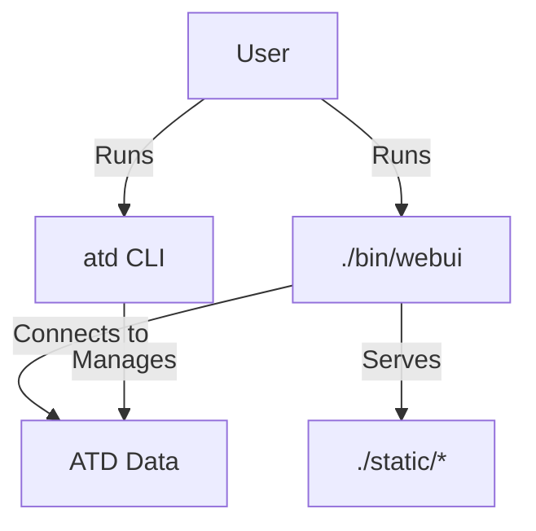
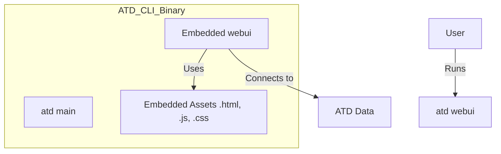

# Issue: Integrate WebUI into ATD CLI

**ID:** `20260402_webui_atd_cli_integration`
**Ref:** `ISS-062`
**Date:** 2026-04-02
**Severity:** Medium
**Status:** Open
**Component:** `scripts/cmd/atd`
**Affects:** `atd` terminal users, `webui` developers

---

## Summary

The `webui` application currently exists as a separate service that must be run independently and has its own duplicated parsing logic. To improve maintainability and user experience, it should be integrated into the main `atd` CLI and relocated to the core logic area (e.g., `scripts/pkg/webui`). This allows sharing of all `atd` related libraries (configuration, exploration, atoms) and enables direct method calls instead of shelling out to binaries. Users should be able to run `atd webui` to launch the interface, with a development option to serve static files from the filesystem instead of using `embed.FS`.

---

## Technical Description

### Background

Currently, `atd` is a CLI tool centered around MCP operations and local ATD management. `webui` is a Gin-based web application located in a separate directory (`/webui`) that serves static files and provides a graphical interface for ATD health and exploration.

### The Problem Scenario

Distributing and running the WebUI requires manual management of a separate process and ensuring the current working directory is correct for the static files to be served.

The desired state is:

### Where This Pattern Exists Today

- `webui/main.go`: Current standalone entry point.
- `scripts/cmd/atd/main.go`: Current CLI entry point.
- `webui/static/`: Static assets that need embedding.

---

## Risk Assessment

| Factor | Value |
|---|---|
| Likelihood | High |
| Impact if triggered | Medium (Improved UX) |
| Detectability | High — command will or won't work |
| Current mitigant | Running `webui` separately |

---

## Recommended Fix

**Short term:** 
1. Create a new implementation plan for the integration.
2. Refactor `webui` to expose its router/server as a library that can be imported.
3. Use `go:embed` to package static assets.

**Medium term:** 
- Add `atd webui` command to the Cobra CLI in `atd/cmd`.
- Update `compile_tools.sh` to handle the new build requirements.

**Long term:** 
- Unify configuration management between the CLI and the WebUI.

---

## References

- [scripts/cmd/atd/main.go](file:///home/bastien/work/skill/scripts/cmd/atd/main.go)
- [webui/main.go](file:///home/bastien/work/skill/webui/main.go)
- [webui/static/](file:///home/bastien/work/skill/webui/static/)
